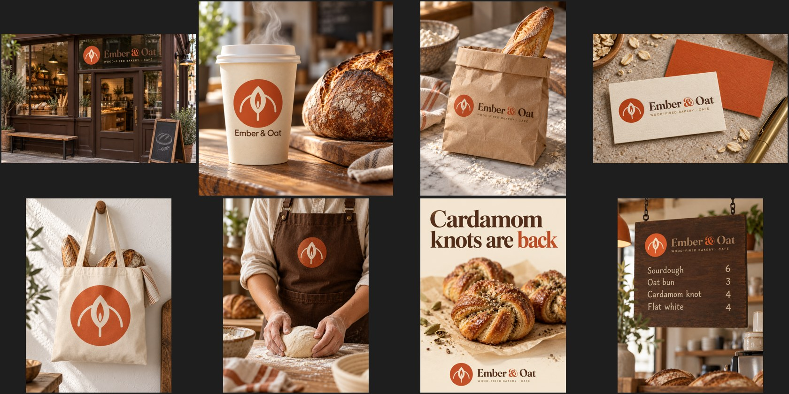
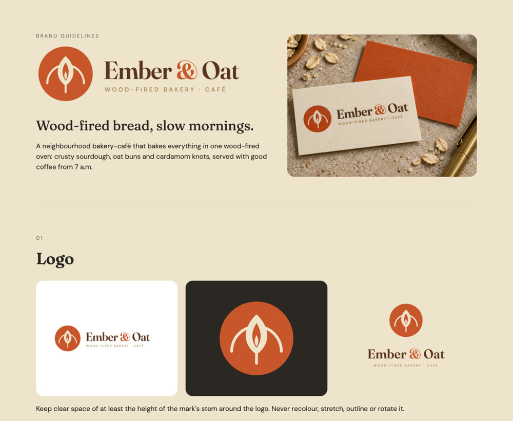

<div align="center">

# HiAPI Brand Kit

**One line about your business → a logo you can edit, a full identity, real-looking mockups and a brand book.**

Strategy · SVG logo system · colours · type · voice · storefront, packaging, merch & social mockups · guidelines page<br>
for Claude Code, Codex and other coding agents · mockups made through [HiAPI](https://www.hiapi.ai/en)

English · [简体中文](README.zh-CN.md) · AI agent? Read [llms-install.md](llms-install.md)



<sub>Ember & Oat, a made-up wood-fired bakery: logo drawn as SVG by the agent, then 8 mockups that reuse the <b>exact</b> logo — $0.40 in total.</sub>

</div>

## Why it looks right

Most AI logo tools ask an image model to *invent* the logo, so the name comes out misspelt and the mark changes from
picture to picture. Here the split is deliberate:

1. **The agent draws the logo as SVG**: real geometry, real fonts, editable, crisp at any size.
2. **The image model only places it**: every mockup is generated *from* the rendered logo (image-to-image with GPT
   Image 2.5 on HiAPI), so the same mark and the same spelling appear on the cup, the bag, the sign and the menu.
3. **One page ties it together**: logo system, colours with their jobs, type, voice and the mockup wall.



[Full brand book →](assets/readme/book-full.jpg) · [Logo SVGs](examples/ember-oat/logo/) · [Mockup plan](examples/ember-oat/plan.json)

## Install

```bash
npx -y github:HiAPIAI/hiapi-brand-kit-skill -y
export HIAPI_API_KEY=your_key        # https://www.hiapi.ai/en/dashboard/api-keys
```

Then ask your agent:

- "Brand a neighbourhood bakery called Ember & Oat: warm, honest, wood-fired."
- "Logo and launch kit for my note-taking app: app icon, App Store page and launch post mockups."
- "Here's our current logo (logo.png) — make storefront, packaging and social mockups and a brand book."

## What you get

| file | what |
|---|---|
| `logo/mark.svg`, `primary.svg`, `stacked.svg` (+ PNG) | the logo system, editable |
| `brand.json` | name, story, audience, personality, colours with jobs, fonts, voice do/don't |
| `mockups/` | photorealistic mockups with the exact logo, plus `manifest.json` with the real cost |
| `brand-book.html` | the one-page guidelines site |

Cost: only the mockups are paid HiAPI calls, $0.05 each at 1K ([pricing](https://www.hiapi.ai/en/pricing)). `--dry-run` shows the estimate first.

## License

MIT. The example brand is fictional.
